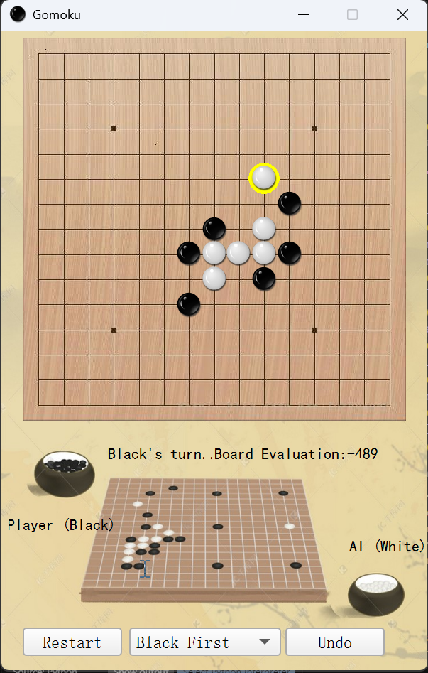

# Gomoku-with-AI-and-GUI

This is the Gomoku Game. AI is implemented by MiniMax and Alpha-Beta algorithm. GUI is implemented by PyQt.

## How to run

1. Install PyQt5
```
pip install PyQt5
```

2. Run mian.py
```
python main.py
```


